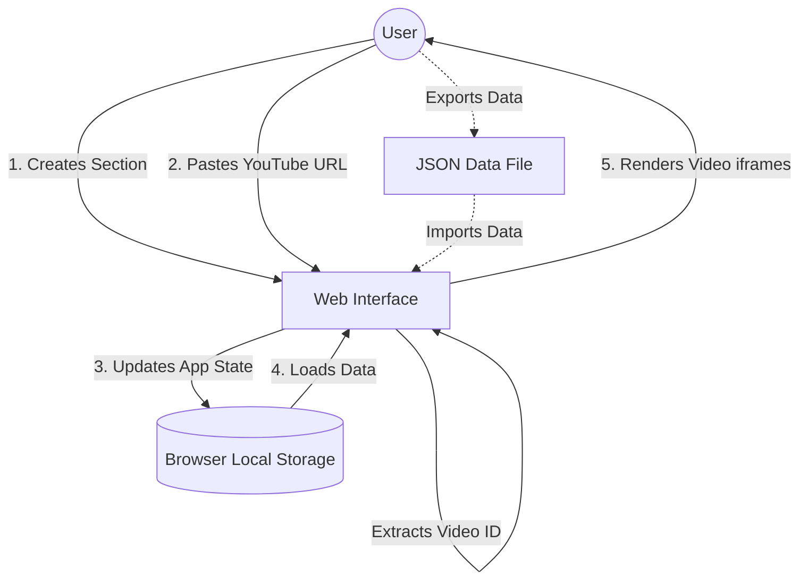

# Multi-Platform Media Playlist Builder

Media Playlist Builder is a lightweight, client-side web application that allows users to create, organize, and manage custom video playlists across multiple platforms (YouTube, Instagram, Reddit, LinkedIn, Threads, IMDb, direct files, and torrents) without needing any accounts.

## Features

- **Create Custom Sections:** Group your videos into distinct playlists or categories.
- **Multi-Platform Support:** Paste a link from YouTube, Instagram, Reddit, LinkedIn, Threads, IMDb (for free movie streaming), online streaming domains, or magnet links to automatically generate the correct embed and thumbnail.
- **Reordering:** Change the priority/order of sections or individual videos seamlessly.
- **Uninterrupted Playback:** UI updates (adding, deleting, moving) happen dynamically without reloading playing videos.
- **Data Export & Import:** Save your playlists as a JSON file to back them up or move them to another device.
- **Recycle Bin:** Accidentally deleted a video or section? Restore it instantly from the Recycle Bin.
- **Dark/Light Theme:** Toggle between themes for comfortable viewing.
- **Local Storage:** Your playlist data is automatically saved to your browser's local storage, ensuring your work is there when you return.

## How it Works (Brainstorming Flow)

Below is a high-level flowchart detailing how data moves through the application:

*(If you have a custom brainstorming diagram image, you can include it below)*  
`<!-- !Brainstorming Flow -->`

## Getting Started

1. Clone or download this repository to your local machine.
2. Open `index.html` in any modern web browser.
3. Start creating your custom playlists!

No server setup, dependencies, or database installations are required, as everything runs completely in the browser.

## Hosting

Since the project consists of pure HTML, CSS, and JavaScript, it is completely static and perfect for hosting on **GitHub Pages**. Simply push this codebase to a repository, navigate to **Settings > Pages**, and set the source to your `main` branch.